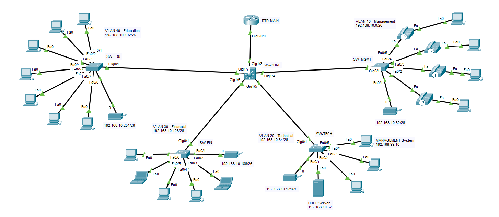

# Enterprise Network Design Lab

## Overview

This project simulates a small enterprise network using Cisco Packet Tracer.
The goal of the lab is to design and implement a structured internal network with VLAN segmentation, centralized management, and basic security features.

The network is divided into multiple departments including:

* Management
* Technical
* Financial
* Education

Each department is configured in a separate VLAN and subnet to improve network organization, scalability, and security.

---

## Objectives

* Design a scalable enterprise-style network
* Implement VLAN segmentation
* Configure Inter-VLAN Routing using Router-on-a-Stick
* Configure centralized DHCP services
* Apply basic security using ACL and SSH
* Practice subnetting and network documentation

---

## Technologies & Concepts Used

* Cisco Packet Tracer
* VLAN
* Trunking (802.1Q)
* Inter-VLAN Routing
* Router-on-a-Stick
* DHCP
* DHCP Relay
* ACL (Access Control List)
* SSH
* Subnetting
* TCP/IP

---

## Network Topology



---

## VLAN Configuration

| VLAN ID | Department | Network Address   |
| ------- | ---------- | ----------------- |
| 10      | Management | 192.168.10.0/26   |
| 20      | Technical  | 192.168.10.64/26  |
| 30      | Financial  | 192.168.10.128/26 |
| 40      | Education  | 192.168.10.192/26 |

---

## Features

* Department separation using VLANs
* Centralized DHCP configuration
* Inter-VLAN communication
* Access control between VLANs
* Secure remote management using SSH
* Structured IP addressing and subnetting
* Basic enterprise network architecture

---

## Project Structure

```text
Network-Design-Lab/
│
├── README.md
│
├── topology/
│   ├── topology.png
│   └── topology.pkt
│
├── configs/
│   ├── router-config.txt
│   ├── switch1-config.txt
│   └── switch2-config.txt
│
├── screenshots/
│   ├── vlan-config.png
│   ├── ping-test.png
│   ├── dhcp-test.png
│   └── ssh-test.png
│
└── documentation/
```

---

## Verification & Testing

The following tests were performed to verify network functionality:

* VLAN communication testing
* Inter-VLAN routing verification
* DHCP address assignment testing
* Ping connectivity tests
* SSH remote access testing
* ACL functionality testing

---

## Screenshots

### VLAN Configuration

(Add screenshot here)

### DHCP Testing

(Add screenshot here)

### Connectivity Test

(Add screenshot here)

### SSH Access

(Add screenshot here)

---

## Future Improvements

* Add firewall simulation
* Implement network monitoring using Zabbix
* Add Syslog and logging
* Implement NAT and Internet access
* Simulate basic SOC monitoring
* Add redundancy and advanced switching concepts

---

## Author

Nima Hafezi
Computer Engineering Student
Interested in Networking & Cybersecurity

---

## License

This project is for educational and learning purposes.
